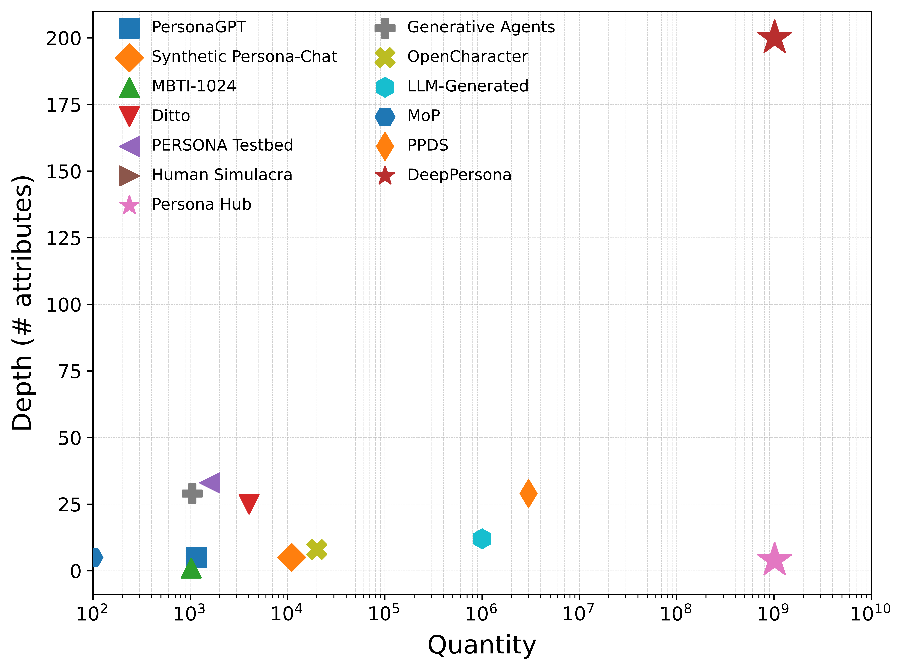
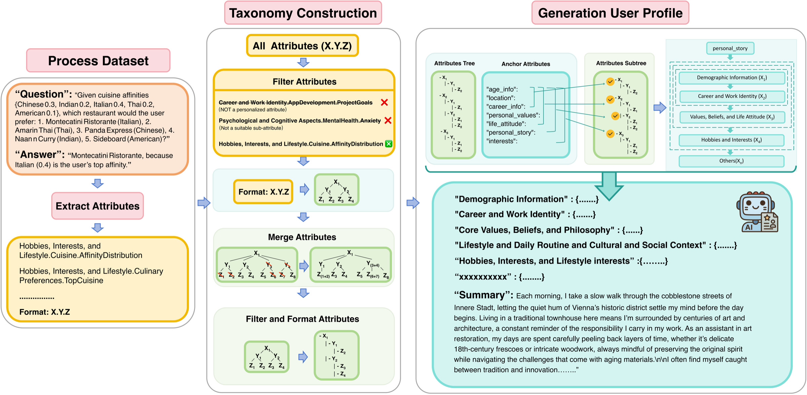
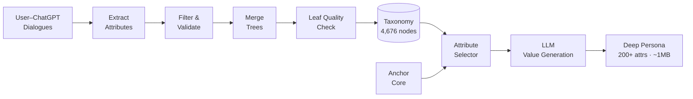
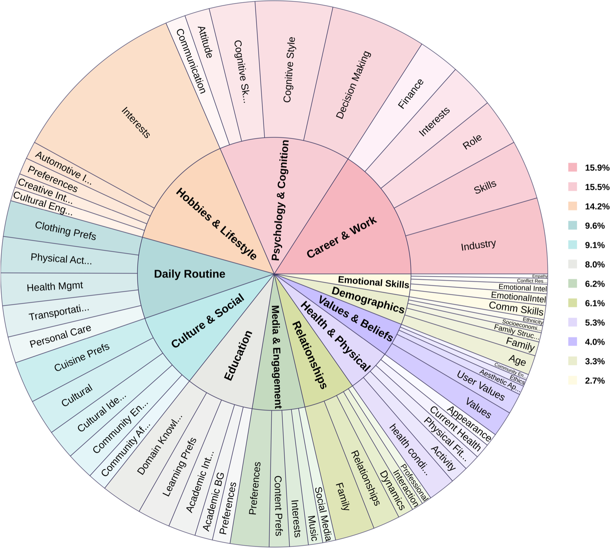
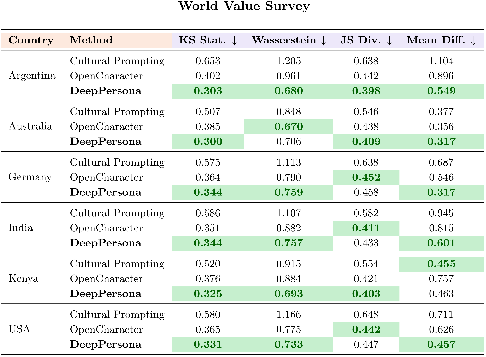

<h1 align="center">
  
  &nbsp;&nbsp;
  
  <br>
  <strong>DeepPersona</strong>
</h1>

<p align="center">
  <em>A Depth-First Synthetic-Persona Engine for Highly Personalized Language Models</em>
</p>

<p align="center">
  <a href="https://arxiv.org/abs/2511.07338"></a>
  <a href="https://thzva.github.io/deeppersona.github.io/"></a>
  <a href="https://huggingface.co/datasets/THzva/deeppersona_dataset"></a>
  <a href="https://deeppersona-sim.zhou-yufan.com/interaction/"></a>
  <a href="#-license"></a>
</p>

<p align="center">
  
  
  
  
  
  
</p>

**DeepPersona** is a scalable generative engine for synthesizing narrative-complete synthetic personas. Built on the largest-ever human-attribute taxonomy mined from real ChatGPT conversations, it produces personas that are **two orders of magnitude deeper** than prior work — hundreds of structured attributes, ~1 MB of coherent narrative text, ready for personalization, social simulation, and human-AI alignment research.

<p align="center">
  
</p>

---

## ✨ Key Features

<table align="center" width="100%">
<tr>
<td width="25%" align="center" style="vertical-align: top; padding: 15px;">

<h3>🌳 Deep Taxonomy</h3>

<div align="center">
  
</div>

<p align="center"><strong>• Mined from real user–ChatGPT dialogues</strong></p>
<p align="center"><strong>• 12 broad top-level categories</strong></p>
<p align="center"><strong>• Hierarchical, continuously extensible</strong></p>

</td>
<td width="25%" align="center" style="vertical-align: top; padding: 15px;">

<h3>🧬 Rich Personas</h3>

<div align="center">
  
</div>

<p align="center"><strong>• 200+ structured attributes per profile</strong></p>
<p align="center"><strong>• Coherent, globally consistent stories</strong></p>
<p align="center"><strong>• Two orders of magnitude deeper than baselines</strong></p>

</td>
<td width="25%" align="center" style="vertical-align: top; padding: 15px;">

<h3>🎯 Controllable Generation</h3>

<div align="center">
  
</div>

<p align="center"><strong>• Anchor traits for targeted cohorts</strong></p>
<p align="center"><strong>• Bias depth toward specific subtrees</strong></p>
<p align="center"><strong>• Enhance existing shallow personas</strong></p>

</td>
<td width="25%" align="center" style="vertical-align: top; padding: 15px;">

<h3>📊 Validated Gains</h3>

<div align="center">
  
</div>

<p align="center"><strong>• +32% attribute coverage vs. SOTA</strong></p>
<p align="center"><strong>• +44% profile uniqueness</strong></p>
<p align="center"><strong>• Closes 32% of the sim–real survey gap</strong></p>

</td>
</tr>
</table>

---

## 🤔 What is DeepPersona?

Simulating human profiles by instilling personas into large language models (LLMs) is rapidly transforming research in **personalization**, **social simulation**, and **human-AI alignment**. Yet most existing synthetic personas remain **shallow and simplistic** — capturing a handful of attributes and failing to reflect real human diversity.

**DeepPersona** addresses this with a two-stage, taxonomy-guided approach:

1. **Stage 1 — Human-Attribute Taxonomy.** We mine 3,000 real user–ChatGPT dialogues, extract fine-grained attributes with GPT-4o, and merge semantically similar branches into **4,676 hierarchically-organized nodes** across 12 categories (Demographics, Health, Core Values, …).
2. **Stage 2 — Progressive Attribute Sampling.** Starting from a stable anchor core (age, location, career, values, …), the selector performs stochastic breadth-first traversal of the taxonomy — biased toward long-tail branches — while the LLM fills each node conditioned on the evolving profile to preserve global coherence.

<p align="center">
  
</p>

> DeepPersona is a **generative engine**, not just a dataset — researchers can control anchors, bias depth, enhance shallow personas, and scale to billions of profiles.

---

## 🚀 Quick Start

### 1. Install

```bash
git clone https://github.com/thzva/Deeppersona.git
cd Deeppersona
pip install openai sentence-transformers scikit-learn numpy tqdm geonamescache
```

### 2. Configure

Set your OpenAI API key in [`generate_user_profile/config.py`](generate_user_profile/config.py):

```python
OPENAI_API_KEY = "sk-..."
```

### 3. Generate a Persona

```python
from generate_user_profile.select_attributes import (
    generate_user_profile,
    get_selected_attributes,
)

# Anchor demographic + psychological core
user_profile = generate_user_profile()

# Progressively sample ~200 attributes from the taxonomy
selected = get_selected_attributes(user_profile, attribute_count=200)

print(user_profile)
print(f"Selected {len(selected)} attributes")
```

### 4. Batch Generation

```bash
python generate_user_profile/generate_profile.py \
    --num-profiles 50 \
    --attribute-count 200
```

### 5. Try It Live

<p align="center">
  <a href="https://deeppersona-sim.zhou-yufan.com/interaction/">
    
  </a>
</p>

> Chat with pre-built DeepPersona profiles in the interactive simulator.

---

## 🏗️ Repository Architecture

```
Deeppersona/
├── generate_user_profile/     # 🧬 Persona generation engine
│   ├── config.py              #    API configuration & client
│   ├── based_data.py          #    Demographic / psychological core
│   ├── select_attributes.py   #    Vector-based attribute selection
│   ├── generate_profile.py    #    Batch orchestrator
│   └── output/                #    Generated profiles
│
├── process_attributes/        # 🌳 Taxonomy construction pipeline
│   ├── extract_personalized_attributes.py   #    Extract attrs from Q&A
│   ├── filter_personalized_attributes.py    #    Quality validation
│   ├── merge_tree.py                        #    Merge multi-source trees
│   ├── check_leaves.py                      #    Semantic + GPT leaf check
│   ├── convert_to_X.Y.Z.py                  #    Flatten to path notation
│   └── process_attributes.py                #    Dedup utility
│
├── data/                      # 📂 Taxonomy & embeddings
│   ├── attributes_merged.json            #    Full taxonomy tree
│   ├── attribute_embeddings.pkl          #    Sentence-transformer vectors
│   └── occupations_english.json          #    Occupation anchor list
│
└── assets/                    # 🖼️  Figures for docs
```

### Pipeline Overview



---

## 🧬 Persona Generation

Full documentation: [`generate_user_profile/README.md`](generate_user_profile/README.md)

| Stage | What it does |
|-------|--------------|
| **Demographic Core** | Age, gender, location (via GeoNames), occupation |
| **Psychological Core** | Personal values, life attitude, coping mechanisms |
| **Story Generation** | Coherent life narrative anchored on the core |
| **Attribute Selection** | Vector search + GPT filtering over 4,676-node taxonomy |
| **Multi-Stage Sampling** | Near / mid / far neighbors → diversity-aware filter |

## 🌳 Taxonomy Processing

Full documentation: [`process_attributes/README.md`](process_attributes/README.md)

| Step | Script | Purpose |
|------|--------|---------|
| **1. Extract** | `extract_personalized_attributes.py` | Pull `X.Y.Z` attribute paths from Q&A |
| **2. Filter** | `filter_personalized_attributes.py` | Drop specific instances, keep categories |
| **3. Merge** | `merge_tree.py` | Combine trees from multiple sources |
| **4. Leaf Check** | `check_leaves.py` | Similarity (threshold 0.85) + GPT-4 validation |
| **5. Convert** | `convert_to_X.Y.Z.py` | Flat paths & tree visualization |

<p align="center">
  
</p>

---

## 📊 Results

We benchmark DeepPersona on three axes — that profiles are **deep, distinct, and useful**.

### Intrinsic Quality

| Metric | PersonaHub | OpenCharacter | **DeepPersona** |
|--------|-----------:|--------------:|----------------:|
| Mean # attributes | 3.98 | 38.50 | **50.92** |
| Uniqueness | 2.50 | 2.86 | **4.12** |
| Actionability | 3.60 | 4.78 | **5.00** |

### Personalization (LLM Q&A)

<p align="center">
  
</p>

DeepPersona lifts GPT-4.1-mini's personalized Q&A accuracy by **+11.6% on average** across ten metrics (Personalization Fit, Attribute Coverage, Depth, Justification, Engagement, …), consistently across backbones (GPT-4.1-mini, GPT-4.1, GPT-4o, Gemini-2.5-Flash).

### Social Simulation

<p align="center">
  
</p>

Across six countries and four distance metrics (KS, Wasserstein, JS Divergence, Mean Diff.), DeepPersona closes **32%** of the gap between simulated LLM "citizens" and authentic World Values Survey responses.

---

## 🎯 Use Cases

| Scenario | How DeepPersona helps |
|----------|----------------------|
| **Personalized LLM evaluation** | Realistic, diverse user proxies for Q&A benchmarks |
| **Social simulation** | High-fidelity citizen cohorts for survey replication |
| **Recommendation & alignment** | Deep preference vectors grounded in coherent identity |
| **Safety red-teaming** | Long-tail demographic coverage beyond majority defaults |
| **Persona augmentation** | Enhance shallow existing personas with taxonomy-guided depth |

---

## 📚 Dataset & Demo

- 📦 **Dataset** — [🤗 `THzva/deeppersona_dataset`](https://huggingface.co/datasets/THzva/deeppersona_dataset) — thousands of diverse, narrative-complete personas.
- 🌐 **Persona Simulator** — [deeppersona-sim.zhou-yufan.com/interaction](https://deeppersona-sim.zhou-yufan.com/interaction/) — interactively chat with pre-built personas.
- 🏠 **Project Homepage** — [thzva.github.io/deeppersona.github.io](https://thzva.github.io/deeppersona.github.io/) — paper, figures, BibTeX.

---

## 📖 Citation

If you use DeepPersona, please cite:

```bibtex
@article{wang2024deeppersona,
    title   = {DeepPersona: A Depth-First Synthetic-Persona Engine for Highly Personalized Language Models},
    author  = {Wang, Zhen and Zhou, Yufan and Luo, Zhongyan and Ye, Lyumanshan and
               Wood, Adam and Yao, Man and Mansour, Saab and Pan, Luoshang},
    journal = {arXiv preprint arXiv:2511.07338},
    year    = {2024}
}
```

---

## 🤝 Contributing

DeepPersona is a research project — contributions are welcome in:

| Area | Examples |
|------|---------|
| **Taxonomy** | New attribute branches, cross-cultural extensions |
| **Selectors** | Alternative sampling strategies (diversity, depth-biased, …) |
| **Evaluation** | New intrinsic / extrinsic benchmarks |
| **Backbones** | Support for more LLM providers |
| **Applications** | Downstream tasks that benefit from deep personas |

Please open an [issue](https://github.com/thzva/Deeppersona/issues) or pull request.

---

## 📧 Contact

- **Email** — [zhouyufan365@gmail.com](mailto:zhouyufan365@gmail.com)
- **Issues** — [GitHub Issues](https://github.com/thzva/Deeppersona/issues)

**Authors:** Zhen Wang¹*, Yufan Zhou²*, Zhongyan Luo¹, Lyumanshan Ye³, Adam Wood⁴, Man Yao⁵, Saab Mansour⁶, Luoshang Pan⁷†
<sub>¹UC San Diego  ·  ²KU Leuven  ·  ³Shanghai Jiao Tong University  ·  ⁴University of Michigan  ·  ⁵Denison University  ·  ⁶Amazon  ·  ⁷Meta</sub>
<sub>*Equal contribution · †Corresponding author</sub>

---

## 🙏 Acknowledgments

- **OpenAI** — GPT APIs powering extraction and generation
- **Sentence Transformers** — semantic embeddings for attribute selection
- **GeoNames** — geographic grounding for demographic anchors
- **Puffin dataset** — source of real user–ChatGPT dialogues

---

## 📄 License

MIT — see [LICENSE](LICENSE).

---

<p align="center">
  <strong>🧬 From shallow personas to research-ready human proxies.</strong>
  <br>
  <em>The taxonomy is the map. The persona is the territory.</em>
</p>

<div align="center">
  <a href="https://star-history.com/#thzva/Deeppersona&Date">
    <picture>
      <source media="(prefers-color-scheme: dark)" srcset="https://api.star-history.com/svg?repos=thzva/Deeppersona&type=Date&theme=dark" />
      <source media="(prefers-color-scheme: light)" srcset="https://api.star-history.com/svg?repos=thzva/Deeppersona&type=Date" />
      
    </picture>
  </a>
</div>

<p align="center">
  <em>Thanks for visiting ✨ DeepPersona!</em>
</p>
